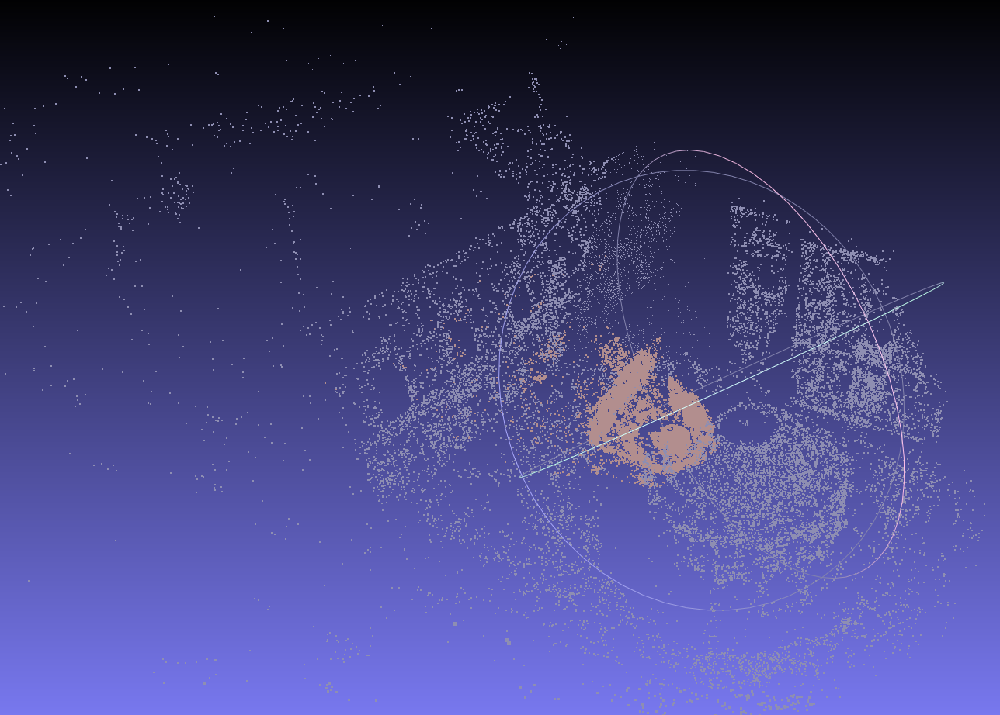

# Korean Ceres-Solver Tutorial
https://lord-is-my-shepherd.notion.site/Tutorial-dc44ccf751f2497faa6667cca6c24a3a

# CMake environment for SLAM BackEnd
> Ceres, Eigen3 built in

# 3rd party libraries
```
$ mkdir thirdparty && cd thirdparty
$ mkdir eigen && cd eigen
$ mkdir build && mkdir install

$ cd ..
$ mkdir ceres && cd ceres
$ mkdir build && mkdir install
```
## Eigen3 build
```
$ cd thirdparty/eigen && wget https://gitlab.com/libeigen/eigen/-/archive/3.3.9/eigen-3.3.9.tar.gz -O eigen.tar.gz
$ mkdir build && mkdir install
$ tar -zxvf eigen.tar.gz
$ cd build && cmake -DCMAKE_BUILD_TYPE=Release -DCMAKE_INSTALL_PREFIX=../install ../eigen-3.3.9
$ make -j
$ sudo make install
```

## Ceres build file download
```
$ sudo apt install libgflags-dev libgoogle-glog-dev libsuitesparse-dev
$ cd thirdparty/ceres && wget http://ceres-solver.org/ceres-solver-2.1.0.tar.gz -O ceres.tar.gz
$ mkdir build && mkdir install
$ tar -zxvf ceres.tar.gz
```
### Change the Eigen directory to my Eigen of thridparty
Edit the CmakeLists.cmake file in the ceres-solver-2.1.0 directory 
```
find_package(Eigen3 3.3 REQUIRED)
----->
find_package(Eigen3 3.3 REQUIRED HINTS /your_directory/SLAM_BackEnd/thirdparty/eigen/install/share/eigen3/cmake)
$ cd build && cmake -DCMAKE_BUILD_TYPE=Debug -DCMAKE_INSTALL_PREFIX=../install ../ceres-solver-2.1.0
```
```
$ make -j7
$ sudo make install
```

# Run BA
## Simple Bundle Adjustment
```
$ cd build
$ ./simpleBA ../sources/problem-16-22106-pre.txt
```
## Bundle Adjustment
```
$ cd build
$ ./BA --input=../sources/problem-16-22106-pre.txt --initial_ply=before.ply --final_ply=after.ply
```
## Results (MeshLab)

- Gray: Before Bundle Adjustment
- Orange: After Bundle Adjustment
